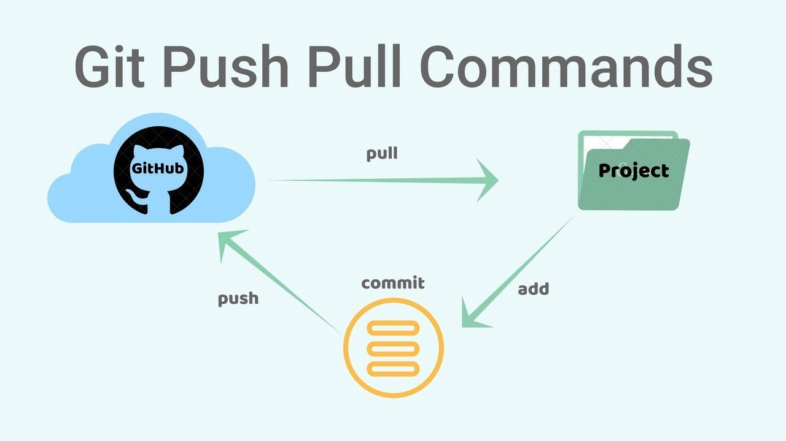

- [Что такое Git?](#что-такое-git)
- [Структура репозитория](#структура-репозитория)
- [Как Git сохраняет изменения](#как-git-сохраняет-изменения)
- [Как работать с Git](#как-работать-с-git)
- [Конфликты и способы их разрешения](#конфликты-и-способы-их-разрешения)
   
## Что такое Git? 
Разработка приложений и программного обеспечения — долгий процесс. Многие задачи в нём выполняют параллельно несколько разработчиков. Их совместную работу нужно  организовать  так, чтобы разные участники команды могли одновременно работать над программой и не мешали друг другу. 
Представьте, что одну большую картину одновременно рисует сразу много художников: кто-то людей, кто-то фон. Промежуточные версии картины нужно сохранять, чтобы понять кто в какой момент что-то добавил. Так и систему контроля версий можно представить в виде альбома. Каждый художник добавляет в него результаты своей работы. Если полистать такой альбом, то можно будет  увидеть, как менялась картина на протяжении творческого процесса. Старые версии можно добавить в текущую или объединить результаты работы участников команды.

## Структура репозитория
Git-репозиторий - это место, где хранятся все файлы вашего проекта и история их изменений.
В репозитории вы можете создавать, редактировать, удалять файлы, а также фиксировать изменения с помощью коммитов. Git-репозиторий позволяет вам отслеживать и контролировать все изменения, которые вы вносите в свой проект. Если вы только начинаете проект, можно превратить текущий каталог в git-репозиторий и начать совместную работу. 

Репозиторий Git состоит из 4 частей:
* Рабочий каталог — локальный каталог, в котором создаётся проект и вносятся изменения
* Промежуточная область, или индекс, куда проект помещают перед фиксацией. Здесь содержимое файлов проверяют другие члены команды.
* Локальный репозиторий, в который вносятся изменения перед отправкой проекта в центральный репозиторий.
* Центральный репозиторий — основной проект на центральном сервере, копия которого находится у каждого члена команды в качестве локального репозитория.

## Как Git сохраняет изменения 

Секрет того как  Git сохраняет изменения  довольно простой. 
Файл может находиться в одном из трёх состояний:
* modified (изменён) - файл поменялся, но изменения не зафиксированы
* staged (проиндексирован) - файл поменялся и отмечен для включения в следующий коммит
* commited (зафиксирован)) - изменения из файла сохранены в локальной базе.

Это разделение реализуется за счет разделения проекта git на три секции: 
* working tree (рабочая копия) — хранит снимок (commit) версии проекта
* staging area (область индексирования) — хранит информацию о том, что попадет в следующий коммит
* git directory (каталог .git) — хранит метаданные и базу объектов проекта.

## Как работать с Git

1. Создаём репозиторий 
<git init> – инициализирует новый репозиторий. Это первая команда, которую вы обычно выполняете, когда создаете новый проект.
   
   ```
   git init
   ```
 В результате в ваш католог добавится подкаталог .git, в котором будет хранится исьтория коммитов и другие данные о вашем проекте.
 
 Пример:

 Результат:


2. Добавляем файлы в репозиторий
    ```
    git add
     ```
 Изменения будут включены в следующий коммит.

 Пример:

 Результат:

3. Проверяем состояние файлов
   ```
   git status
   ```
Используйте команду git status, чтобы проверить текущее состояние репозитория: какие файлы были изменены, но еще не добавлены в индекс (staged), и какие файлы уже добавлены в индекс.

 Пример:

 Результат:

1. git commit – переносит индексированные файлы в коммит, добавляя сообщение. Эта операция сохраняет изменения в истории Git.
2. git add -p – добавляет файлы в индекс интерактивно. Это позволяет выбирать, какие изменения добавить и какие оставить только в рабочем каталоге.
3. git branch – показывает ветки или создает новую ветку.
 git checkout) – переключает ветку (или любой коммит, любое дерево) в ваш рабочий каталог.

1. git diff – показывает различия между любыми двумя состояниями в вашем рабочем каталоге, индексе, HEAD или между любыми коммитами.
   
2. git log – выводит полную историю коммитов.

Схема коммитов и пушей


## Конфликты и способы их разрешения 